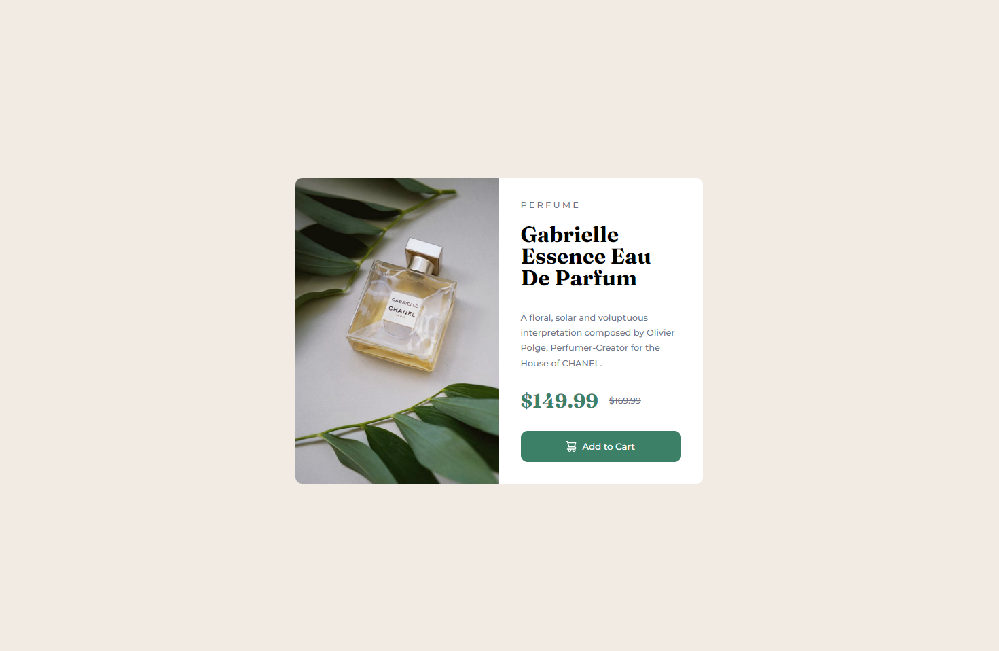
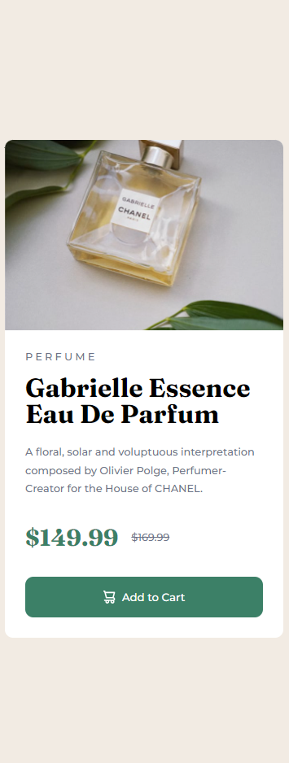

# 01. Product preview card component solution
### 최종 결과물
- [라이브 사이트 URL](https://01-product-preview-card-component.vercel.app/)
 
 

## 목차

- [개요](#개요)
  - [챌린지](#챌린지)
  - [결과물](#결과물)
  - [링크](#링크)
 
 

## 개요

### 챌린지
- 디바이스의 화면 크기에 따라 최적의 반응형 레이아웃
- 인터랙티브 요소에 대한 hover 및 focus 상태
 
 

### 결과물

#### 1. 데스크탑 (1440px)

 
 

#### 2. 모바일 (375px)

 
 

### 링크

- [솔루션 레포지토리 URL](https://github.com/angielxx/Frontend-Mentor-Challenges/tree/main/01_Product-preview-card-component)
- [라이브 사이트 URL](https://01-product-preview-card-component.vercel.app/)