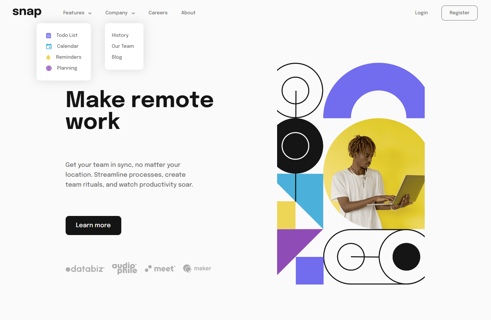
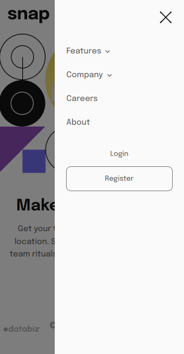
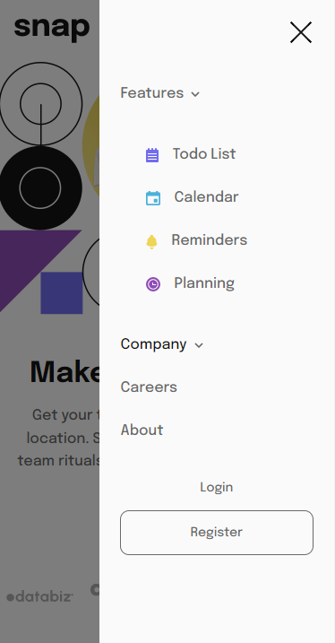

# 02. intro section with dropdown navigation main
### 최종 결과물
- [라이브 사이트 URL](https://02-intro-section-with-dropdown-navigation-main.vercel.app/)
 
 

## 목차

- [개요](#개요)
  - [챌린지](#챌린지)
  - [결과물](#결과물)
  - [링크](#링크)
 
 

## 개요

### 챌린지
- 내비게이션 링크와 상호 작용 시 데스크톱 및 모바일에서 적절한 드롭 다운 메뉴 구현
- 디바이스의 화면 크기에 따른 최적의 레이아웃 구현
- 페이지 내의 모든 인터렉티브 요소에 대해 hover 상태 스타일 구현
 
 

### 결과물

#### 1. 데스크탑 (1440px)

 
 

#### 2. 모바일 (375px)

 
 

### 링크

- [솔루션 레포지토리 URL](https://github.com/angielxx/Frontend-Mentor-Challenges/tree/main/02_intro-section-with-dropdown-navigation-main)
- [라이브 사이트 URL](https://02-intro-section-with-dropdown-navigation-main.vercel.app/)