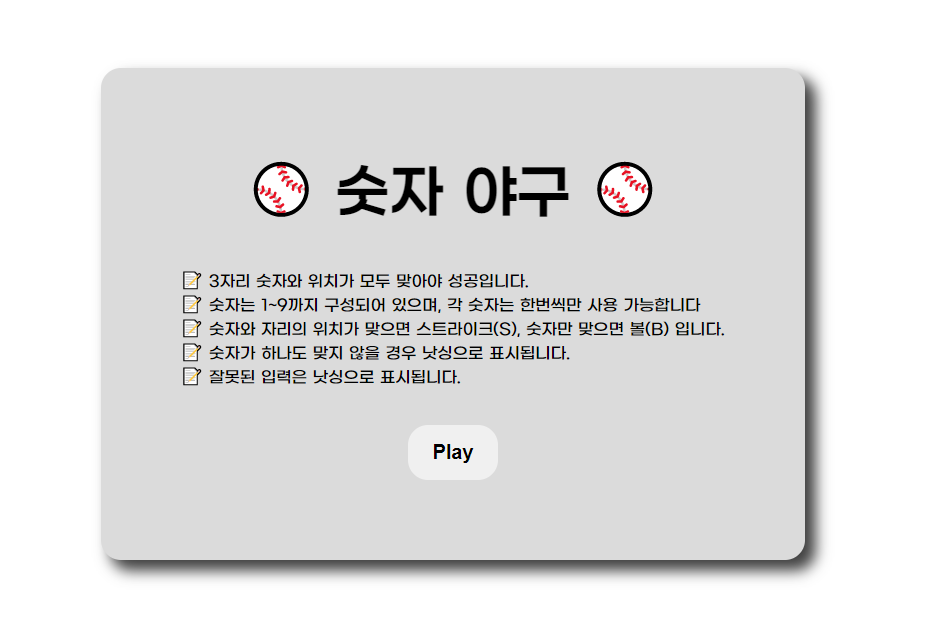
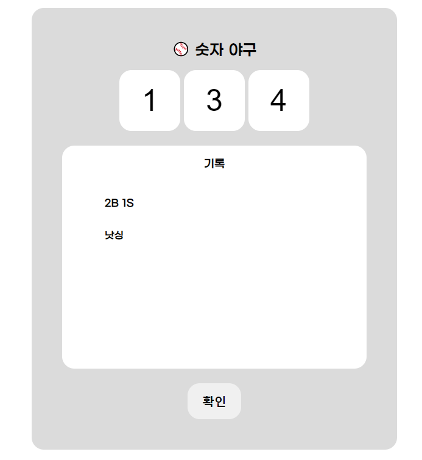
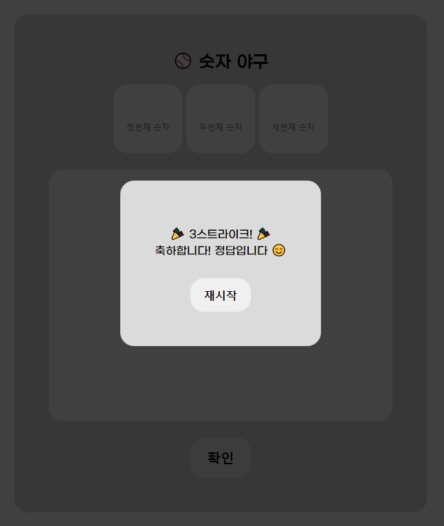
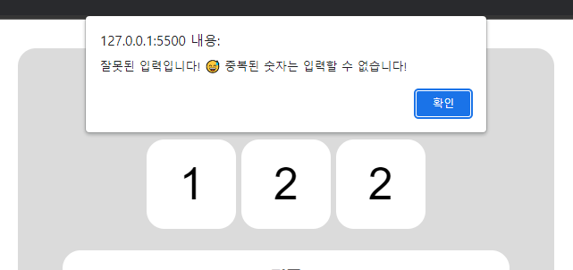
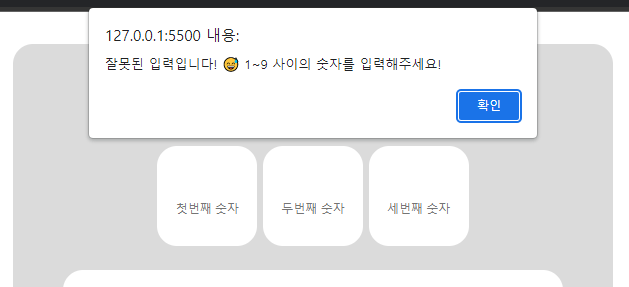

### ⚾ 숫자 야구 게임

---

우아한테크코스 프리코스의 숫자 야구 게임 명세를 기반으로 만든 숫자 야구 게임입니다.

✏ 함수가 한가지 일만 하도록 작게 만드는 것이 어려웠습니다. 기존에는 main.js 파일에 주요기능들을 한번에 작성하는 방식으로 작업을 해왔기 때문에 js파일들을 기능별로 작성하고 import해서 사용하는 것이 익숙하지 않아서 많이 헤맸습니다. 하지만 시간이 지날수록 필요한 기능을 가져와서 사용하는 모듈화 방식이 편리하고 효율적이라는 것을 느낄 수 있었습니다.

